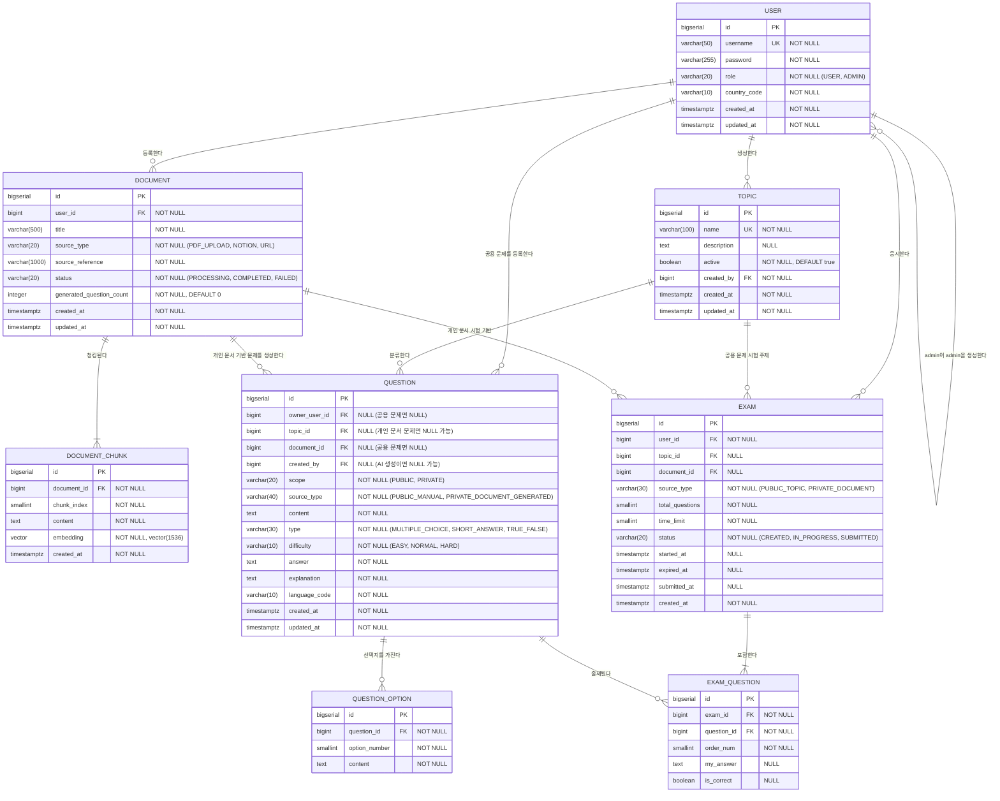

# TMK (Test My Knowledge) ERD 설계

> 작성일: 2026-04-27
> 버전: v2.0.0
> DB: PostgreSQL

---

## ERD 다이어그램



---

## 테이블 상세 설명

### USER

사용자 계정입니다. 일반 사용자와 관리자 모두 같은 테이블에서 관리합니다.

| 컬럼 | 타입 | NULL | 설명 |
|------|------|------|------|
| id | BIGSERIAL | NOT NULL | PK |
| username | VARCHAR(50) | NOT NULL | 로그인 아이디, UNIQUE |
| password | VARCHAR(255) | NOT NULL | bcrypt 암호화 비밀번호 |
| role | VARCHAR(20) | NOT NULL | `USER`, `ADMIN` |
| country_code | VARCHAR(10) | NOT NULL | 문제 생성 언어 결정을 위한 국가 코드 |
| created_at | TIMESTAMPTZ | NOT NULL | 생성 일시 |
| updated_at | TIMESTAMPTZ | NOT NULL | 수정 일시 |

### TOPIC

서비스 공용 문제를 분류하는 주제입니다. admin이 생성/관리합니다.

| 컬럼 | 타입 | NULL | 설명 |
|------|------|------|------|
| id | BIGSERIAL | NOT NULL | PK |
| name | VARCHAR(100) | NOT NULL | Topic 이름, UNIQUE |
| description | TEXT | NULL | Topic 설명 |
| active | BOOLEAN | NOT NULL | 사용 여부 |
| created_by | BIGINT | NOT NULL | 생성한 admin ID |
| created_at | TIMESTAMPTZ | NOT NULL | 생성 일시 |
| updated_at | TIMESTAMPTZ | NOT NULL | 수정 일시 |

### DOCUMENT

사용자가 등록한 문제 생성용 문서의 메타데이터입니다. 원본 파일/원문은 생성 완료 후 서버 저장소에서 삭제하며, 이 테이블에는 추적용 메타정보만 남깁니다.

| 컬럼 | 타입 | NULL | 설명 |
|------|------|------|------|
| id | BIGSERIAL | NOT NULL | PK |
| user_id | BIGINT | NOT NULL | 문서 등록 사용자 ID |
| title | VARCHAR(500) | NOT NULL | 문서 제목 |
| source_type | VARCHAR(20) | NOT NULL | `PDF_UPLOAD`, `NOTION`, `URL` |
| source_reference | VARCHAR(1000) | NOT NULL | 업로드 파일명 또는 읽은 노션/URL 참조값 |
| status | VARCHAR(20) | NOT NULL | `PROCESSING`, `COMPLETED`, `FAILED` |
| generated_question_count | INTEGER | NOT NULL | 생성된 문제 수 |
| created_at | TIMESTAMPTZ | NOT NULL | 생성 일시 |
| updated_at | TIMESTAMPTZ | NOT NULL | 수정 일시 |

### DOCUMENT_CHUNK

문제 생성에 사용되는 청크와 임베딩입니다.

| 컬럼 | 타입 | NULL | 설명 |
|------|------|------|------|
| id | BIGSERIAL | NOT NULL | PK |
| document_id | BIGINT | NOT NULL | FK → DOCUMENT.id |
| chunk_index | SMALLINT | NOT NULL | 문서 내 청크 순서 |
| content | TEXT | NOT NULL | 청크 텍스트 |
| embedding | vector(1536) | NOT NULL | 임베딩 벡터 |
| created_at | TIMESTAMPTZ | NOT NULL | 생성 일시 |

### QUESTION

문제 본문입니다. 공용 문제는 admin이 직접 등록하고, 개인 문제는 사용자 문서에서 AI가 생성합니다.

| 컬럼 | 타입 | NULL | 설명 |
|------|------|------|------|
| id | BIGSERIAL | NOT NULL | PK |
| owner_user_id | BIGINT | NULL | 개인 문제 소유 사용자 ID. 공용 문제면 NULL |
| topic_id | BIGINT | NULL | 공용 문제의 Topic ID |
| document_id | BIGINT | NULL | 개인 문서 기반 문제의 원본 문서 ID |
| created_by | BIGINT | NULL | 공용 문제를 등록한 admin ID |
| scope | VARCHAR(20) | NOT NULL | `PUBLIC`, `PRIVATE` |
| source_type | VARCHAR(40) | NOT NULL | `PUBLIC_MANUAL`, `PRIVATE_DOCUMENT_GENERATED` |
| content | TEXT | NOT NULL | 문제 내용 |
| type | VARCHAR(30) | NOT NULL | `MULTIPLE_CHOICE`, `SHORT_ANSWER`, `TRUE_FALSE` |
| difficulty | VARCHAR(10) | NOT NULL | `EASY`, `NORMAL`, `HARD` |
| answer | TEXT | NOT NULL | 정답 |
| explanation | TEXT | NOT NULL | 해설 |
| language_code | VARCHAR(10) | NOT NULL | 생성 언어 코드 |
| created_at | TIMESTAMPTZ | NOT NULL | 생성 일시 |
| updated_at | TIMESTAMPTZ | NOT NULL | 수정 일시 |

### QUESTION_OPTION

객관식과 참/거짓형 선택지입니다. 객관식은 5개, 참/거짓형은 2개 선택지를 가집니다.

| 컬럼 | 타입 | NULL | 설명 |
|------|------|------|------|
| id | BIGSERIAL | NOT NULL | PK |
| question_id | BIGINT | NOT NULL | FK → QUESTION.id |
| option_number | SMALLINT | NOT NULL | 선택지 번호 |
| content | TEXT | NOT NULL | 선택지 내용 |

### EXAM

시험 세션입니다. 특정 Topic의 공용 문제로 시작하거나, 특정 문서에서 생성된 개인 문제로 시작합니다.

| 컬럼 | 타입 | NULL | 설명 |
|------|------|------|------|
| id | BIGSERIAL | NOT NULL | PK |
| user_id | BIGINT | NOT NULL | 응시 사용자 ID |
| topic_id | BIGINT | NULL | 공용 Topic 시험인 경우 사용 |
| document_id | BIGINT | NULL | 개인 문서 시험인 경우 사용 |
| source_type | VARCHAR(30) | NOT NULL | `PUBLIC_TOPIC`, `PRIVATE_DOCUMENT` |
| total_questions | SMALLINT | NOT NULL | 사용자 지정 문제 수 |
| time_limit | SMALLINT | NOT NULL | 사용자 지정 시험 시간(분) |
| status | VARCHAR(20) | NOT NULL | `CREATED`, `IN_PROGRESS`, `SUBMITTED` |
| started_at | TIMESTAMPTZ | NULL | 시작 전에는 NULL, 시작 시점 확정 |
| expired_at | TIMESTAMPTZ | NULL | 시작 전에는 NULL, 시작 시점 확정 |
| submitted_at | TIMESTAMPTZ | NULL | 제출 일시 |
| created_at | TIMESTAMPTZ | NOT NULL | 생성 일시 |

### EXAM_QUESTION

시험에 포함된 문제와 사용자의 답안/채점 결과입니다.

| 컬럼 | 타입 | NULL | 설명 |
|------|------|------|------|
| id | BIGSERIAL | NOT NULL | PK |
| exam_id | BIGINT | NOT NULL | FK → EXAM.id |
| question_id | BIGINT | NOT NULL | FK → QUESTION.id |
| order_num | SMALLINT | NOT NULL | 시험 내 순서 |
| my_answer | TEXT | NULL | 사용자 답안 |
| is_correct | BOOLEAN | NULL | 채점 전 NULL |

---

## 연관 관계 정리

| 관계 | 설명 |
|------|------|
| USER : DOCUMENT | 1:N — 한 사용자는 여러 문서를 등록할 수 있다 |
| USER : EXAM | 1:N — 한 사용자는 여러 시험을 응시할 수 있다 |
| USER : TOPIC | 1:N — 한 admin은 여러 Topic을 만들 수 있다 |
| USER : QUESTION | 1:N — 한 admin은 여러 공용 문제를 등록할 수 있다 |
| TOPIC : QUESTION | 1:N — 하나의 Topic은 여러 공용 문제를 가진다 |
| DOCUMENT : DOCUMENT_CHUNK | 1:N — 하나의 문서는 여러 청크로 분할된다 |
| DOCUMENT : QUESTION | 1:N — 하나의 문서에서 여러 개인 문제가 생성된다 |
| QUESTION : QUESTION_OPTION | 1:N — 객관식/참거짓 문제는 선택지를 가진다 |
| EXAM : EXAM_QUESTION | 1:N — 하나의 시험은 여러 문항을 포함한다 |
| QUESTION : EXAM_QUESTION | 1:N — 하나의 문제는 여러 시험에 출제될 수 있다 |

---

## 인덱스 설계

### USER

```sql
CREATE UNIQUE INDEX uq_user_username ON "user" (username);
CREATE INDEX idx_user_role ON "user" (role);
```

### TOPIC

```sql
CREATE UNIQUE INDEX uq_topic_name ON topic (name);
CREATE INDEX idx_topic_active ON topic (active);
```

### DOCUMENT

```sql
CREATE INDEX idx_document_user_id_created_at ON document (user_id, created_at DESC);
CREATE INDEX idx_document_status ON document (status);
```

### DOCUMENT_CHUNK

```sql
CREATE INDEX idx_document_chunk_document_id ON document_chunk (document_id);
CREATE INDEX idx_document_chunk_embedding_hnsw ON document_chunk
    USING hnsw (embedding vector_cosine_ops)
    WITH (m = 16, ef_construction = 64);
```

### QUESTION

```sql
CREATE INDEX idx_question_owner_user_id ON question (owner_user_id);
CREATE INDEX idx_question_topic_id ON question (topic_id);
CREATE INDEX idx_question_document_id ON question (document_id);
CREATE INDEX idx_question_scope_topic_difficulty ON question (scope, topic_id, difficulty);
CREATE INDEX idx_question_scope_document_difficulty ON question (scope, document_id, difficulty);
```

### QUESTION_OPTION

```sql
CREATE INDEX idx_question_option_question_id ON question_option (question_id);
```

### EXAM

```sql
CREATE INDEX idx_exam_user_id_created_at ON exam (user_id, created_at DESC);
CREATE INDEX idx_exam_expired_at_in_progress ON exam (expired_at)
    WHERE status = 'IN_PROGRESS';
```

### EXAM_QUESTION

```sql
CREATE INDEX idx_exam_question_exam_id_order ON exam_question (exam_id, order_num);
CREATE INDEX idx_exam_question_question_id ON exam_question (question_id);
```

---

## 설계 메모

- Topic은 관리 대상이므로 정적 enum이 아니라 관리 가능한 데이터로 취급합니다.
- 원본 문서는 서버 저장소에 영구 보관하지 않고, 문제 생성 완료 후 삭제합니다.
- 단답형 문제는 문서에 실제 존재하는 명시적 문자열/내용으로만 정답 판정이 가능해야 합니다.
- 참/거짓 문제는 자유 입력이 아닌 2지선다 선택형으로 저장/응시합니다.
