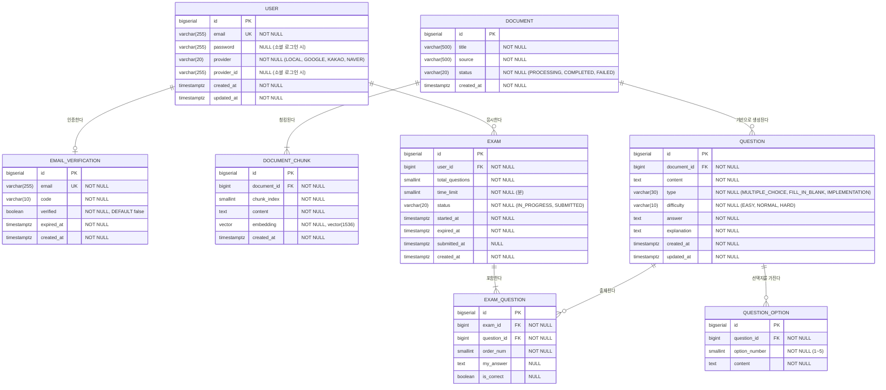

# TMK (Test My Knowledge) ERD 설계

> 작성일: 2026-03-10
> 버전: v1.0.0
> DB: PostgreSQL

---

## ERD 다이어그램



---

## 테이블 상세 설명

### USER (사용자)

사용자 계정 정보를 저장합니다. 일반 로그인과 소셜 로그인을 모두 지원합니다.

| 컬럼 | 타입 | NULL | 설명 |
|------|------|------|------|
| id | BIGSERIAL | NOT NULL | PK |
| email | VARCHAR(255) | NOT NULL | 이메일, UNIQUE |
| password | VARCHAR(255) | NULL | bcrypt 암호화된 비밀번호. 소셜 로그인 시 NULL |
| provider | VARCHAR(20) | NOT NULL | 가입 경로 (`LOCAL`, `GOOGLE`, `KAKAO`, `NAVER`) |
| provider_id | VARCHAR(255) | NULL | 소셜 로그인 제공자의 사용자 식별자 |
| created_at | TIMESTAMPTZ | NOT NULL | 생성 일시 |
| updated_at | TIMESTAMPTZ | NOT NULL | 수정 일시 |

---

### EMAIL_VERIFICATION (이메일 인증)

이메일 인증 코드 정보를 저장합니다.
> 만료 처리 특성상 Redis에서 관리하는 것을 권장하지만, 이력 관리가 필요한 경우 RDB에도 저장합니다.

| 컬럼 | 타입 | NULL | 설명 |
|------|------|------|------|
| id | BIGSERIAL | NOT NULL | PK |
| email | VARCHAR(255) | NOT NULL | 인증 대상 이메일, UNIQUE |
| code | VARCHAR(10) | NOT NULL | 인증 코드 (6자리) |
| verified | BOOLEAN | NOT NULL | 인증 완료 여부. DEFAULT false |
| expired_at | TIMESTAMPTZ | NOT NULL | 인증 코드 만료 일시 |
| created_at | TIMESTAMPTZ | NOT NULL | 생성 일시 |

---

### DOCUMENT (문서)

내부 API를 통해 등록된 원본 문서입니다. 등록 즉시 청킹 → 임베딩 → pgvector 저장 → 문제 생성 파이프라인이 실행됩니다. MVP에서는 PDF만 지원합니다.

| 컬럼 | 타입 | NULL | 설명 |
|------|------|------|------|
| id | BIGSERIAL | NOT NULL | PK |
| title | VARCHAR(500) | NOT NULL | 문서 제목 |
| source | VARCHAR(500) | NOT NULL | PDF 파일 저장 경로. 재처리 시 이 경로를 통해 PDF를 재파싱 |
| status | VARCHAR(20) | NOT NULL | 처리 상태 (`PROCESSING`: 처리 중, `COMPLETED`: 완료, `FAILED`: 실패) |
| created_at | TIMESTAMPTZ | NOT NULL | 생성 일시 |

---

### DOCUMENT_CHUNK (문서 청크)

문서를 일정 크기로 분할한 청크와 OpenAI 임베딩 벡터를 저장합니다. pgvector 확장의 `vector` 타입을 사용하며, 문제 생성 시 사용자 요청 임베딩과의 코사인 유사도 검색(ANN)에 활용됩니다.

| 컬럼 | 타입 | NULL | 설명 |
|------|------|------|------|
| id | BIGSERIAL | NOT NULL | PK |
| document_id | BIGINT | NOT NULL | FK → DOCUMENT.id |
| chunk_index | SMALLINT | NOT NULL | 문서 내 청크 순서 (0부터 시작) |
| content | TEXT | NOT NULL | 청크 원문 텍스트 |
| embedding | vector(1536) | NOT NULL | OpenAI text-embedding-3-small 임베딩 벡터 (1536차원) |
| created_at | TIMESTAMPTZ | NOT NULL | 생성 일시 |

---

### QUESTION (문제)

AI가 문서를 기반으로 생성한 문제입니다.

| 컬럼 | 타입 | NULL | 설명 |
|------|------|------|------|
| id | BIGSERIAL | NOT NULL | PK |
| document_id | BIGINT | NOT NULL | FK → DOCUMENT.id |
| content | TEXT | NOT NULL | 문제 내용 |
| type | VARCHAR(30) | NOT NULL | 문제 유형 (`MULTIPLE_CHOICE`, `FILL_IN_BLANK`, `IMPLEMENTATION`) |
| difficulty | VARCHAR(10) | NOT NULL | 난이도 (`EASY`, `NORMAL`, `HARD`) |
| answer | TEXT | NOT NULL | 정답 |
| explanation | TEXT | NOT NULL | 해설 |
| created_at | TIMESTAMPTZ | NOT NULL | 생성 일시 |
| updated_at | TIMESTAMPTZ | NOT NULL | 수정 일시 |

---

### QUESTION_OPTION (문제 선택지)

객관식 문제(`MULTIPLE_CHOICE`)의 선택지 데이터입니다. 5지선다이므로 문제당 5개의 행이 생성됩니다.

| 컬럼 | 타입 | NULL | 설명 |
|------|------|------|------|
| id | BIGSERIAL | NOT NULL | PK |
| question_id | BIGINT | NOT NULL | FK → QUESTION.id |
| option_number | SMALLINT | NOT NULL | 선택지 번호 (1~5) |
| content | TEXT | NOT NULL | 선택지 내용 |

---

### EXAM (시험)

사용자가 응시한 시험 정보입니다.

| 컬럼 | 타입 | NULL | 설명 |
|------|------|------|------|
| id | BIGSERIAL | NOT NULL | PK |
| user_id | BIGINT | NOT NULL | FK → USER.id |
| total_questions | SMALLINT | NOT NULL | 총 문제 수 (최소 10) |
| time_limit | SMALLINT | NOT NULL | 시험 제한 시간 (분, 기본 30) |
| status | VARCHAR(20) | NOT NULL | 시험 상태 (`IN_PROGRESS`, `SUBMITTED`) |
| started_at | TIMESTAMPTZ | NOT NULL | 시험 시작 일시 |
| expired_at | TIMESTAMPTZ | NOT NULL | 시험 만료 일시 |
| submitted_at | TIMESTAMPTZ | NULL | 제출 일시. 미제출 시 NULL |
| created_at | TIMESTAMPTZ | NOT NULL | 생성 일시 |

---

### EXAM_QUESTION (시험 문제)

시험에 포함된 문제와 사용자 답안을 함께 관리하는 연결 테이블입니다.

| 컬럼 | 타입 | NULL | 설명 |
|------|------|------|------|
| id | BIGSERIAL | NOT NULL | PK |
| exam_id | BIGINT | NOT NULL | FK → EXAM.id |
| question_id | BIGINT | NOT NULL | FK → QUESTION.id |
| order_num | SMALLINT | NOT NULL | 문제 출제 순서 |
| my_answer | TEXT | NULL | 사용자 제출 답안. 미응답 시 NULL |
| is_correct | BOOLEAN | NULL | 정답 여부. 채점 전 NULL |

---

## 연관 관계 정리

| 관계 | 설명 |
|------|------|
| USER : EXAM | 1:N — 한 사용자는 여러 시험을 응시할 수 있다 |
| USER : EMAIL_VERIFICATION | 1:1 — 한 사용자는 하나의 인증 정보를 가진다 |
| DOCUMENT : DOCUMENT_CHUNK | 1:N — 하나의 문서는 여러 청크로 분할된다 |
| DOCUMENT : QUESTION | 1:N — 하나의 문서에서 여러 문제가 생성된다 (최소 2개) |
| QUESTION : QUESTION_OPTION | 1:N — 객관식 문제는 5개의 선택지를 가진다 |
| EXAM : EXAM_QUESTION | 1:N — 하나의 시험은 여러 시험 문제를 포함한다 (최소 10개) |
| QUESTION : EXAM_QUESTION | 1:N — 하나의 문제는 여러 시험에 출제될 수 있다 |

---

## 인덱스 설계

> PK, UNIQUE 제약조건에 의한 인덱스는 PostgreSQL이 자동 생성하므로 별도 명시하지 않습니다.

### USER

```sql
-- 소셜 로그인 조회: provider + provider_id 복합 조건으로 사용자 식별
CREATE INDEX idx_user_provider_provider_id ON "user" (provider, provider_id)
    WHERE provider_id IS NOT NULL;
```

| 인덱스명 | 대상 컬럼 | 종류 | 이유 |
|----------|-----------|------|------|
| idx_user_provider_provider_id | (provider, provider_id) | 부분 인덱스 | 소셜 로그인 시 provider + provider_id 조합으로 사용자 조회. provider_id가 NULL인 일반 로그인 행 제외 |

---

### EMAIL_VERIFICATION

```sql
-- Spring Batch: 만료된 인증 코드 정기 삭제 시 만료 일시 기준 스캔
CREATE INDEX idx_email_verification_expired_at ON email_verification (expired_at);
```

| 인덱스명 | 대상 컬럼 | 종류 | 이유 |
|----------|-----------|------|------|
| idx_email_verification_expired_at | expired_at | B-tree | 만료된 인증 코드 정리 배치 작업 시 범위 스캔 성능 향상 |

---

### DOCUMENT

```sql
-- 문서 수집 시 중복 등록 방지를 위한 출처 조회
CREATE INDEX idx_document_source ON document (source);

-- 처리 중인 문서 조회 (배치 재처리, 모니터링용)
CREATE INDEX idx_document_status ON document (status)
    WHERE status IN ('PROCESSING', 'FAILED');
```

| 인덱스명 | 대상 컬럼 | 종류 | 이유 |
|----------|-----------|------|------|
| idx_document_source | source | B-tree | 동일 출처 문서 중복 수집 방지 조회 |
| idx_document_status | status (부분) | 부분 인덱스 | 처리 미완료 문서만 인덱싱. COMPLETED 행 제외로 인덱스 크기 최소화 |

---

### DOCUMENT_CHUNK

```sql
-- FK 조인: document → document_chunk
CREATE INDEX idx_document_chunk_document_id ON document_chunk (document_id);

-- 벡터 유사도 검색 인덱스 (HNSW, 코사인 유사도)
-- pgvector 확장 필요: CREATE EXTENSION IF NOT EXISTS vector;
CREATE INDEX idx_document_chunk_embedding_hnsw ON document_chunk
    USING hnsw (embedding vector_cosine_ops)
    WITH (m = 16, ef_construction = 64);
```

| 인덱스명 | 대상 컬럼 | 종류 | 이유 |
|----------|-----------|------|------|
| idx_document_chunk_document_id | document_id | B-tree | 문서 삭제·조회 시 청크 일괄 접근 |
| idx_document_chunk_embedding_hnsw | embedding | HNSW | 코사인 유사도 기반 근사 최근접 이웃(ANN) 검색. IVFFlat 대비 사전 학습 불필요, 안정적인 쿼리 성능 보장 |

---

### QUESTION

```sql
-- FK 조인: document → question
CREATE INDEX idx_question_document_id ON question (document_id);

-- 시험 문제 구성 시 유형 + 난이도 조건으로 랜덤 출제
CREATE INDEX idx_question_type_difficulty ON question (type, difficulty);
```

| 인덱스명 | 대상 컬럼 | 종류 | 이유 |
|----------|-----------|------|------|
| idx_question_document_id | document_id | B-tree | DOCUMENT JOIN 시 FK 탐색 성능 향상 |
| idx_question_type_difficulty | (type, difficulty) | 복합 B-tree | 시험 구성 시 유형·난이도 조건 필터 후 `ORDER BY RANDOM()` 추출. 두 조건을 동시에 사용하므로 단일 인덱스보다 복합이 효율적 |

---

### QUESTION_OPTION

```sql
-- FK 조인: question → question_option (문제 조회 시 선택지 일괄 로드)
CREATE INDEX idx_question_option_question_id ON question_option (question_id);
```

| 인덱스명 | 대상 컬럼 | 종류 | 이유 |
|----------|-----------|------|------|
| idx_question_option_question_id | question_id | B-tree | 문제 상세 조회 시 선택지 일괄 로드 (1:5 관계로 접근 빈도 높음) |

---

### EXAM

```sql
-- FK 조인 + 히스토리 조회: 특정 사용자의 시험 목록
CREATE INDEX idx_exam_user_id ON exam (user_id);

-- 사용자의 진행 중 시험 조회 (시험 응시 중 재진입 시)
CREATE INDEX idx_exam_user_id_status ON exam (user_id, status);

-- Spring Batch: 만료된 시험 자동 제출 처리
CREATE INDEX idx_exam_expired_at_status ON exam (expired_at)
    WHERE status = 'IN_PROGRESS';
```

| 인덱스명 | 대상 컬럼 | 종류 | 이유 |
|----------|-----------|------|------|
| idx_exam_user_id | user_id | B-tree | 사용자 시험 히스토리 목록 조회 시 FK 탐색 |
| idx_exam_user_id_status | (user_id, status) | 복합 B-tree | 사용자의 진행 중 시험 조회. `WHERE user_id = ? AND status = 'IN_PROGRESS'` 패턴에 최적화 |
| idx_exam_expired_at_status | expired_at (부분) | 부분 인덱스 | 배치가 만료 시험을 자동 제출할 때 `IN_PROGRESS` 행만 스캔. 이미 제출된 행 제외로 인덱스 크기 최소화 |

---

### EXAM_QUESTION

```sql
-- FK 조인 + 시험 문제 목록 조회 (순서 포함)
CREATE INDEX idx_exam_question_exam_id_order ON exam_question (exam_id, order_num);

-- FK 조인: question → exam_question
CREATE INDEX idx_exam_question_question_id ON exam_question (question_id);
```

| 인덱스명 | 대상 컬럼 | 종류 | 이유 |
|----------|-----------|------|------|
| idx_exam_question_exam_id_order | (exam_id, order_num) | 복합 B-tree | 시험 문제 목록을 순서대로 조회할 때 `ORDER BY order_num` 포함 정렬 제거 효과. exam_id만 단독 인덱스를 두는 것보다 정렬 비용 절감 |
| idx_exam_question_question_id | question_id | B-tree | 채점 시 question → exam_question 방향 조인, 히스토리 상세 조회 시 사용 |

---

## PostgreSQL 특이사항

- **BIGSERIAL**: `BIGINT` + `SEQUENCE` 자동 생성. JPA에서는 `GenerationType.IDENTITY` 또는 `GenerationType.SEQUENCE` 사용
- **TIMESTAMPTZ**: 타임존 정보를 포함하는 타임스탬프. 서버 타임존과 무관하게 UTC로 저장되므로 다중 환경에서 안전. JPA에서는 `OffsetDateTime` 또는 `Instant` 매핑 권장
- **SMALLINT**: 값 범위가 작은 컬럼(`order_num`, `total_questions`, `time_limit`, `option_number`, `chunk_index`)에 적용하여 저장 공간 절약 (2 bytes vs INT 4 bytes)
- **부분 인덱스 (Partial Index)**: `WHERE` 절 조건을 포함한 인덱스. `IN_PROGRESS` 상태의 시험 행, 처리 미완료 문서 행만 인덱싱 — PostgreSQL 고유 기능
- **Enum 처리**: `provider`, `type`, `difficulty`, `status`는 PostgreSQL 네이티브 ENUM 타입 대신 `VARCHAR` + `CHECK` 제약조건 방식으로 설계. JPA와의 호환성 및 값 추가 유연성 확보
- **pgvector 확장**: `vector` 타입은 PostgreSQL 기본 타입이 아니며 `CREATE EXTENSION IF NOT EXISTS vector;` 실행 후 사용 가능. `DOCUMENT_CHUNK.embedding` 컬럼에 적용
- **HNSW 인덱스**: pgvector의 근사 최근접 이웃(ANN) 인덱스. `m`(연결 수)과 `ef_construction`(인덱스 빌드 탐색 범위)으로 정확도와 빌드 속도를 조절. 기본값 `m=16, ef_construction=64` 적용

---

## 설계 비고

- **Vector DB**: DOCUMENT_CHUNK 테이블이 pgvector 확장을 이용해 벡터 저장소 역할을 담당합니다. 별도 Vector DB 없이 PostgreSQL 단일 인스턴스로 운영합니다.
- **문서 처리 파이프라인**: 내부 API로 PDF 등록 → 텍스트 파싱 → 청킹 → OpenAI 임베딩 → DOCUMENT_CHUNK 저장 → LLM 문제 생성 순서로 진행됩니다. MVP에서는 사용자가 직접 문서를 등록하지 않습니다.
- **Redis 활용**: 이메일 인증 코드, JWT 리프레시 토큰, 시험 진행 중 임시 답안 저장은 Redis에서 TTL 기반으로 관리합니다.
- **소프트 딜리트 미적용**: MVP 단계에서는 하드 딜리트를 기본으로 합니다.
- **시험 채점**: `EXAM_QUESTION.is_correct`는 시험 제출(`EXAM.status = SUBMITTED`) 시점에 일괄 업데이트됩니다.
