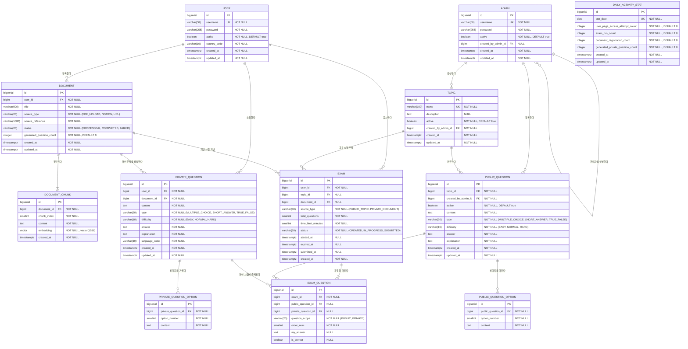

# TMK (Test My Knowledge) ERD 설계

> 작성일: 2026-04-27
> 버전: v3.0.0
> 기준 문서: `TMK(Test My Knowledge).md`, `API 명세서.md`, `관리자 웹 요구사항.md`
> 전제: 현재 구현 코드가 아니라 목표 요구사항 기준 설계

---

## 설계 원칙

- 일반 사용자 계정과 관리자 계정은 별도 테이블로 분리한다.
- 공용 문제와 개인 문제는 생성 주체와 관리 방식이 다르므로 별도 테이블로 분리한다.
- 시험은 공용 문제 기반 시험과 개인 문제 기반 시험을 모두 지원해야 한다.
- 관리자 모니터링은 일별 집계 테이블을 기준으로 조회하고, 주별/월별은 집계 결과를 재가공한다.
- 원본 문서는 문제 생성 후 서버 저장소에서 삭제하고, DB에는 메타데이터와 생성 산출물만 유지한다.
- 관계선과 `FK` 표기는 논리적 참조 관계를 의미하며, 실제 DB DDL은 외래키 제약을 두지 않는다.

---

## ERD 다이어그램



---

## 테이블 상세 설명

### USER

일반 사용자 계정입니다.

| 컬럼 | 타입 | NULL | 설명 |
|------|------|------|------|
| id | BIGSERIAL | NOT NULL | PK |
| username | VARCHAR(50) | NOT NULL | 로그인 아이디, UNIQUE |
| password | VARCHAR(255) | NOT NULL | bcrypt 암호화 비밀번호 |
| active | BOOLEAN | NOT NULL | 사용자 활성 여부 |
| country_code | VARCHAR(10) | NOT NULL | 문제/정답/해설 생성 언어 결정을 위한 국가 코드 |
| created_at | TIMESTAMPTZ | NOT NULL | 생성 일시 |
| updated_at | TIMESTAMPTZ | NOT NULL | 수정 일시 |

### ADMIN

관리자 계정입니다. 일반 사용자와 분리해 저장합니다.

| 컬럼 | 타입 | NULL | 설명 |
|------|------|------|------|
| id | BIGSERIAL | NOT NULL | PK |
| username | VARCHAR(50) | NOT NULL | 관리자 로그인 아이디, UNIQUE |
| password | VARCHAR(255) | NOT NULL | bcrypt 암호화 비밀번호 |
| active | BOOLEAN | NOT NULL | 관리자 활성 여부 |
| created_by_admin_id | BIGINT | NULL | 이 계정을 생성한 상위 관리자 |
| created_at | TIMESTAMPTZ | NOT NULL | 생성 일시 |
| updated_at | TIMESTAMPTZ | NOT NULL | 수정 일시 |

### TOPIC

공용 문제를 분류하는 관리자 관리 주제입니다.

| 컬럼 | 타입 | NULL | 설명 |
|------|------|------|------|
| id | BIGSERIAL | NOT NULL | PK |
| name | VARCHAR(100) | NOT NULL | Topic 이름, UNIQUE |
| description | TEXT | NULL | Topic 설명 |
| active | BOOLEAN | NOT NULL | Topic 활성 여부 |
| created_by_admin_id | BIGINT | NOT NULL | 생성한 관리자 |
| created_at | TIMESTAMPTZ | NOT NULL | 생성 일시 |
| updated_at | TIMESTAMPTZ | NOT NULL | 수정 일시 |

### DOCUMENT

사용자가 등록한 문제 생성용 문서 메타데이터입니다.

| 컬럼 | 타입 | NULL | 설명 |
|------|------|------|------|
| id | BIGSERIAL | NOT NULL | PK |
| user_id | BIGINT | NOT NULL | 문서 등록 사용자 |
| title | VARCHAR(500) | NOT NULL | 문서 제목 |
| source_type | VARCHAR(20) | NOT NULL | `PDF_UPLOAD`, `NOTION`, `URL` |
| source_reference | VARCHAR(1000) | NOT NULL | 업로드 파일명 또는 링크 참조값 |
| status | VARCHAR(20) | NOT NULL | `PROCESSING`, `COMPLETED`, `FAILED` |
| generated_question_count | INTEGER | NOT NULL | 생성된 개인 문제 수 |
| created_at | TIMESTAMPTZ | NOT NULL | 생성 일시 |
| updated_at | TIMESTAMPTZ | NOT NULL | 수정 일시 |

### DOCUMENT_CHUNK

RAG 문제 생성에 쓰는 청크와 임베딩입니다.

| 컬럼 | 타입 | NULL | 설명 |
|------|------|------|------|
| id | BIGSERIAL | NOT NULL | PK |
| document_id | BIGINT | NOT NULL | FK → DOCUMENT.id |
| chunk_index | SMALLINT | NOT NULL | 문서 내 청크 순서 |
| content | TEXT | NOT NULL | 청크 본문 |
| embedding | vector(1536) | NOT NULL | 임베딩 벡터 |
| created_at | TIMESTAMPTZ | NOT NULL | 생성 일시 |

### PRIVATE_QUESTION

사용자 문서에서 AI가 생성한 개인 문제입니다.

| 컬럼 | 타입 | NULL | 설명 |
|------|------|------|------|
| id | BIGSERIAL | NOT NULL | PK |
| user_id | BIGINT | NOT NULL | 문제 소유 사용자 |
| document_id | BIGINT | NOT NULL | 생성 기반 문서 |
| content | TEXT | NOT NULL | 문제 본문 |
| type | VARCHAR(30) | NOT NULL | `MULTIPLE_CHOICE`, `SHORT_ANSWER`, `TRUE_FALSE` |
| difficulty | VARCHAR(10) | NOT NULL | `EASY`, `NORMAL`, `HARD` |
| answer | TEXT | NOT NULL | 정답 |
| explanation | TEXT | NOT NULL | 해설 |
| language_code | VARCHAR(10) | NOT NULL | 생성 언어 코드 |
| created_at | TIMESTAMPTZ | NOT NULL | 생성 일시 |
| updated_at | TIMESTAMPTZ | NOT NULL | 수정 일시 |

### PRIVATE_QUESTION_OPTION

개인 문제의 선택지입니다.

| 컬럼 | 타입 | NULL | 설명 |
|------|------|------|------|
| id | BIGSERIAL | NOT NULL | PK |
| private_question_id | BIGINT | NOT NULL | FK → PRIVATE_QUESTION.id |
| option_number | SMALLINT | NOT NULL | 선택지 번호 |
| content | TEXT | NOT NULL | 선택지 내용 |

### PUBLIC_QUESTION

관리자가 직접 등록하는 공용 문제입니다.

| 컬럼 | 타입 | NULL | 설명 |
|------|------|------|------|
| id | BIGSERIAL | NOT NULL | PK |
| topic_id | BIGINT | NOT NULL | FK → TOPIC.id |
| created_by_admin_id | BIGINT | NOT NULL | 등록한 관리자 |
| active | BOOLEAN | NOT NULL | 문제 활성 여부 |
| content | TEXT | NOT NULL | 문제 본문 |
| type | VARCHAR(30) | NOT NULL | `MULTIPLE_CHOICE`, `SHORT_ANSWER`, `TRUE_FALSE` |
| difficulty | VARCHAR(10) | NOT NULL | `EASY`, `NORMAL`, `HARD` |
| answer | TEXT | NOT NULL | 정답 |
| explanation | TEXT | NOT NULL | 해설 |
| created_at | TIMESTAMPTZ | NOT NULL | 생성 일시 |
| updated_at | TIMESTAMPTZ | NOT NULL | 수정 일시 |

### PUBLIC_QUESTION_OPTION

공용 문제의 선택지입니다.

| 컬럼 | 타입 | NULL | 설명 |
|------|------|------|------|
| id | BIGSERIAL | NOT NULL | PK |
| public_question_id | BIGINT | NOT NULL | FK → PUBLIC_QUESTION.id |
| option_number | SMALLINT | NOT NULL | 선택지 번호 |
| content | TEXT | NOT NULL | 선택지 내용 |

### EXAM

사용자가 생성한 시험 세션입니다.

| 컬럼 | 타입 | NULL | 설명 |
|------|------|------|------|
| id | BIGSERIAL | NOT NULL | PK |
| user_id | BIGINT | NOT NULL | 응시 사용자 |
| topic_id | BIGINT | NULL | 공용 Topic 시험일 때 사용 |
| document_id | BIGINT | NULL | 개인 문서 시험일 때 사용 |
| source_type | VARCHAR(30) | NOT NULL | `PUBLIC_TOPIC`, `PRIVATE_DOCUMENT` |
| total_questions | SMALLINT | NOT NULL | 사용자 지정 문제 수 |
| time_limit_minutes | SMALLINT | NOT NULL | 사용자 지정 시험 시간(분) |
| status | VARCHAR(20) | NOT NULL | `CREATED`, `IN_PROGRESS`, `SUBMITTED` |
| started_at | TIMESTAMPTZ | NULL | 시작 시각 |
| expired_at | TIMESTAMPTZ | NULL | 종료 예정 시각 |
| submitted_at | TIMESTAMPTZ | NULL | 제출 시각 |
| created_at | TIMESTAMPTZ | NOT NULL | 생성 일시 |

### EXAM_QUESTION

시험에 포함된 실제 문항과 답안/채점 결과입니다.

| 컬럼 | 타입 | NULL | 설명 |
|------|------|------|------|
| id | BIGSERIAL | NOT NULL | PK |
| exam_id | BIGINT | NOT NULL | FK → EXAM.id |
| public_question_id | BIGINT | NULL | 공용 문제 기반 문항일 때 사용 |
| private_question_id | BIGINT | NULL | 개인 문제 기반 문항일 때 사용 |
| question_scope | VARCHAR(20) | NOT NULL | `PUBLIC`, `PRIVATE` |
| order_num | SMALLINT | NOT NULL | 시험 내 순서 |
| my_answer | TEXT | NULL | 사용자 답안 |
| is_correct | BOOLEAN | NULL | 채점 결과 |

### DAILY_ACTIVITY_STAT

관리자 모니터링용 일별 집계 테이블입니다.

| 컬럼 | 타입 | NULL | 설명 |
|------|------|------|------|
| id | BIGSERIAL | NOT NULL | PK |
| stat_date | DATE | NOT NULL | 집계 기준 일자 |
| user_page_access_attempt_count | INTEGER | NOT NULL | 사용자 웹 접근 시도 수 |
| exam_run_count | INTEGER | NOT NULL | 시험 진행 수 |
| document_registration_count | INTEGER | NOT NULL | 문서 등록 수 |
| generated_private_question_count | INTEGER | NOT NULL | 생성된 개인 문제 수 |
| created_at | TIMESTAMPTZ | NOT NULL | 생성 일시 |
| updated_at | TIMESTAMPTZ | NOT NULL | 수정 일시 |

---

## 연관 관계 정리

| 관계 | 설명 |
|------|------|
| USER : DOCUMENT | 1:N — 사용자는 여러 문서를 등록할 수 있다 |
| USER : PRIVATE_QUESTION | 1:N — 사용자는 여러 개인 문제를 가진다 |
| USER : EXAM | 1:N — 사용자는 여러 시험을 응시할 수 있다 |
| ADMIN : ADMIN | 1:N — 한 관리자는 다른 관리자 계정을 생성할 수 있다 |
| ADMIN : TOPIC | 1:N — 한 관리자는 여러 Topic을 생성할 수 있다 |
| ADMIN : PUBLIC_QUESTION | 1:N — 한 관리자는 여러 공용 문제를 등록할 수 있다 |
| DOCUMENT : DOCUMENT_CHUNK | 1:N — 하나의 문서는 여러 청크로 나뉜다 |
| DOCUMENT : PRIVATE_QUESTION | 1:N — 하나의 문서에서 여러 개인 문제가 생성된다 |
| TOPIC : PUBLIC_QUESTION | 1:N — 하나의 Topic은 여러 공용 문제를 가진다 |
| PRIVATE_QUESTION : PRIVATE_QUESTION_OPTION | 1:N — 개인 문제는 선택지를 가질 수 있다 |
| PUBLIC_QUESTION : PUBLIC_QUESTION_OPTION | 1:N — 공용 문제는 선택지를 가질 수 있다 |
| EXAM : EXAM_QUESTION | 1:N — 하나의 시험은 여러 문항을 포함한다 |

---

## 인덱스 설계

### USER

```sql
CREATE UNIQUE INDEX uq_user_username ON "user" (username);
CREATE INDEX idx_user_active ON "user" (active);
```

### ADMIN

```sql
CREATE UNIQUE INDEX uq_admin_username ON admin (username);
CREATE INDEX idx_admin_active ON admin (active);
```

### TOPIC

```sql
CREATE UNIQUE INDEX uq_topic_name ON topic (name);
CREATE INDEX idx_topic_active ON topic (active);
CREATE INDEX idx_topic_created_by_admin_id ON topic (created_by_admin_id);
```

### DOCUMENT

```sql
CREATE INDEX idx_document_user_id_created_at ON document (user_id, created_at DESC);
CREATE INDEX idx_document_status ON document (status);
```

### DOCUMENT_CHUNK

```sql
CREATE INDEX idx_document_chunk_document_id ON document_chunk (document_id);
CREATE INDEX idx_document_chunk_embedding_hnsw ON document_chunk
    USING hnsw (embedding vector_cosine_ops)
    WITH (m = 16, ef_construction = 64);
```

### PRIVATE_QUESTION

```sql
CREATE INDEX idx_private_question_user_id ON private_question (user_id);
CREATE INDEX idx_private_question_document_id ON private_question (document_id);
CREATE INDEX idx_private_question_difficulty ON private_question (difficulty);
```

### PUBLIC_QUESTION

```sql
CREATE INDEX idx_public_question_topic_id ON public_question (topic_id);
CREATE INDEX idx_public_question_active ON public_question (active);
CREATE INDEX idx_public_question_type_difficulty ON public_question (type, difficulty);
```

### OPTION TABLES

```sql
CREATE INDEX idx_private_question_option_question_id ON private_question_option (private_question_id);
CREATE INDEX idx_public_question_option_question_id ON public_question_option (public_question_id);
```

### EXAM

```sql
CREATE INDEX idx_exam_user_id_created_at ON exam (user_id, created_at DESC);
CREATE INDEX idx_exam_topic_id ON exam (topic_id);
CREATE INDEX idx_exam_document_id ON exam (document_id);
CREATE INDEX idx_exam_expired_at_in_progress ON exam (expired_at)
    WHERE status = 'IN_PROGRESS';
```

### EXAM_QUESTION

```sql
CREATE INDEX idx_exam_question_exam_id_order ON exam_question (exam_id, order_num);
CREATE INDEX idx_exam_question_public_question_id ON exam_question (public_question_id);
CREATE INDEX idx_exam_question_private_question_id ON exam_question (private_question_id);
```

### DAILY_ACTIVITY_STAT

```sql
CREATE UNIQUE INDEX uq_daily_activity_stat_date ON daily_activity_stat (stat_date);
```

---

## 비고

- 이 문서는 목표 요구사항 기준 ERD이며, 현재 코드 구현 상태와 다를 수 있다.
- 관리자 계정과 일반 사용자 계정은 독립적으로 저장하는 방향을 전제로 한다.
- Topic 삭제 정책, 공용 문제 삭제 정책, 모니터링 집계 생성 방식은 애플리케이션 서비스/배치 설계에서 추가 확정이 필요하다.
