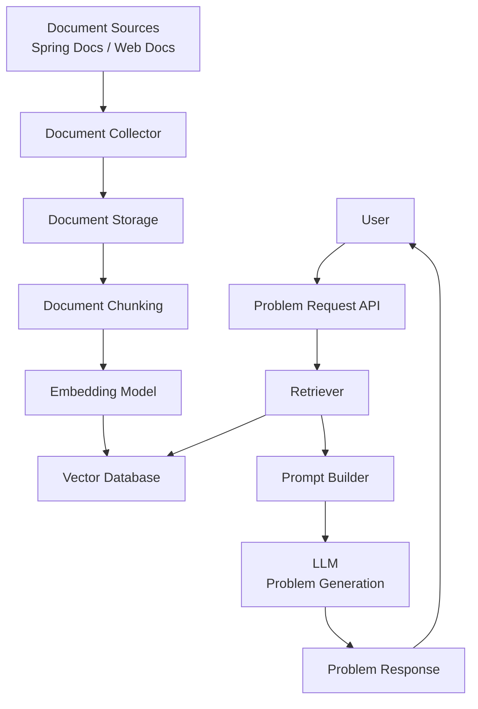

# TMK (Test My Knowledge)

## 프로젝트 설명
AI 기반 문제은행 플랫폼으로, 다양한 문서와 지식 자료를 바탕으로 자동으로 문제를 생성하고 학습자가 자신의 이해도를 확인할 수 있도록 돕는 서비스

## 프로젝트 목적
- AI 기반 문제 생성 기능을 통해 다양한 학습 자료를 문제 형태로 변환한다.
- 사용자가 학습한 내용을 시험 형태로 확인할 수 있도록 한다.
- 시험 결과 분석을 통해 사용자의 학습 이해도를 확인할 수 있도록 한다.
- 문서 기반 문제 생성 시스템을 구축하여 다양한 분야의 학습 콘텐츠에 활용할 수 있도록 한다

## 기술 스택
- Spring Boot
- Java
- Redis
- JWT 인증
- OpenAI
- PostgreSQL
- Spring batch
- JPA
- JPQL
- RAG

## 아키텍쳐
- 클린 아키텍처 기반 설계 (실무 수준의 계층 분리 지향)
- 멀티 모듈 아키텍처
    - 코어 모듈
    - batch 모듈
    - api 모듈

## 요구사항 (MVP)
1. 사용자 관련
    - 사용자는 이메일과 비밀번호를 입력받아 회원 가입을 한다.
    - 회원 가입시 이메일을 통한 인증을 진행한다.
    - 사용자는 이메일과 비밀 번호를 통해 인증을 한다.
    - 사용자는 로그아웃을 할 수 있다.
    - 사용자는 소셜 로그인을 할 수 있다.

2. 문제 생성
    - 문제를 만들 문서를 등록하면 문제를 생성한다.
    - 문제 생성은 AI 모델을 이용하여 수행된다.
    - 문제 유형은 다음과 같다.
        - 객관식 (5지선다)
        - 빈칸 채우기
        - 구현 문제 (소프트웨어 개발 분야)
    - 구현 문제는 특정 코드의 일부를 작성하는 형태로 제공된다.
    - 문제는 난이도 정보를 가진다.
        - 쉬움
        - 보통
        - 어려움
    - 시스템은 각 문서에서 최소 2개 이상의 문제를 생성한다.
    - 생성된 문제에는 다음 정보가 포함된다.
        - 문제 내용
        - 문제 유형
        - 난이도
        - 정답
        - 해설

3. 시험 기능
    - 시스템은 생성된 문제를 기반으로 시험을 구성한다.
    - 시험은 최소 10문제로 구성된다.
    - 시험에는 각 난이도별 문제가 최소 1개 이상 포함된다.
    - 시험 시간은 기본 30분을 기준으로 문제 수에 따라 증가할 수 있다.
    - 사용자는 시험 문제를 확인하고 답안을 작성할 수 있다.
    - 사용자는 시험 시간 내에 답안을 수정할 수 있다.
    - 사용자는 시험을 조기 제출할 수 있다.
    - 시험 시간이 종료되면 시스템은 자동으로 시험을 제출한다.
    - 시험 제출 후 시스템은 채점을 수행한다.
    - 시험 결과는 정답률을 기준으로 합격 여부를 판단한다.
        - 정답률 50% 이상 -> 성공
        - 정답률 50% 미만 -> 실패
    - 채점이 완료 되면 사용자에게 결과가 제공된다.
    
4. 시험 히스토리 보여주기
    - 시험 결과를 볼 수 있다.
    - 시험 결과에는 총점, 통과 여부를 간략하게 보여준다.
    - 상세 보기를 통해 문제와 정답, 해설을 볼 수 있다.

5. 비기능 요구사항
    - 시스템은 인증된 사용자만 서비스 기능을 사용할 수 있도록 해야 한다.
    - 시스템은 사용자 데이터와 시험 결과 데이터를 안전하게 저장해야 한다.
    - 시스템은 AI 문제 생성 기능을 안정적으로 수행할 수 있어야 한다.
    - 시스템은 향후 다양한 문서 업로드 기능 확장을 고려하여 설계되어야 한다.
    - 시스템은 확장 가능한 구조(모듈화 및 계층 분리)를 기반으로 구현되어야 한다.

## 시스템 아키텍쳐 다이어그램

API 명세 작성 -> ERD 설계 -> 도메인 모델 설계 -> 멀티 모듈 구조 생성 

문제 생성 파이프라인 
- Document
- ↓
- Chunk
- ↓
- Embedding
- ↓
- Vector DB
- ↓
- LLM
- ↓
- Question