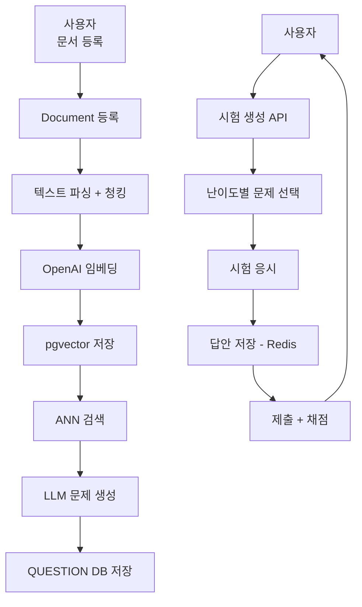

# TMK (Test My Knowledge)

> **AI 기반 자동 문제 생성 및 지능형 시험 플랫폼**
> 버전: 0.0.1-SNAPSHOT | 상태: MVP 개발 중

## 프로젝트 설명

사용자가 직접 업로드한 PDF 문서 또는 `.md` 형식 문서를 등록하면 OpenAI를 통해 자동으로 시험 문제를 생성하고, 사용자가 시험을 응시하여 학습 이해도를 확인할 수 있는 AI 기반 문제은행 플랫폼입니다.

웹 레이어는 `tmk-user-web`, `tmk-admin-web`로 분리하며, 관리자 웹은 로그인, 모니터링, 공용문제 관리, 관리자 관리 화면을 제공합니다.

### 핵심 기술 특징

- **RAG 기반 문제 생성**: 문서를 청킹 → OpenAI 임베딩(1536차원) → pgvector ANN 검색 → LLM 문제 생성
- **자동 채점**: Spring Batch가 매분 만료된 시험을 감지하여 자동 제출 및 채점
- **간소화된 인증**: 아이디 / 비밀번호 기반 회원가입 및 로그인
- **캐시 최적화**: Redis로 JWT 토큰, 시험 임시 답안 관리

---

## 왜 이 서비스가 필요한가?

1. **시험 출제에 드는 시간 낭비**: 교육 자료에서 문제를 수동으로 만드는 작업은 과목당 2~3시간 소요
2. **즉각적 피드백 부재**: 오프라인 평가에서 벗어난 온라인 환경에서 즉시 채점 및 결과 분석이 필요
3. **정형화된 문제 은행의 한계**: 기존 시스템은 고정된 문제만 제공, 새 학습 자료에 맞춘 자동 생성 불가

**TMK 해결책**: 사용자 문서 등록 → 자동 문제 생성 (시간 절감 85% 이상), 즉시 채점, 난이도별 맞춤 시험

---

## 대상 사용자

| 사용자 | 요구사항 | 기대효과 |
|--------|----------|----------|
| **교육 기관** (학교, 학원) | 교과서 기반 시험 자동 출제 | 출제 시간 단축, 문제 은행 자동화 |
| **온라인 교육 플랫폼** | 강의 콘텐츠 맞춤 퀴즈 생성 | 학습자 참여도 증가 |
| **개인 학습자** | 학습 자료 기반 자가 진단 | 이해도 정량화, 학습 동기 부여 |

---

## 기술 스택

| 분류 | 기술 | 버전 |
|------|------|------|
| 언어 | Java | 21 LTS |
| 프레임워크 | Spring Boot | 3.5.11 |
| 보안 | Spring Security + JJWT | 6.x / 0.12.6 |
| DB | PostgreSQL + pgvector | 14+ / 0.5.0+ |
| 캐시 | Redis | 7.x |
| ORM | Spring Data JPA | Spring Boot 3.5 |
| 배치 | Spring Batch | Spring Boot 3.5 |
| AI | OpenAI API | text-embedding-3-small, GPT-4 |

> 자세한 기술 선택 이유 및 개발 환경 설정은 [기술 스택.md](./기술 스택.md) 참고

---

## 아키텍처

### 멀티 모듈 구조

```
tmk-parent/
├── tmk-core/     # 도메인 엔티티, 애플리케이션 서비스, outbound port
├── tmk-infra/    # Spring Data JPA repository + persistence adapter
├── tmk-api/      # 사용자 API + 관리자 API, Boot Application, JWT, AI/Redis adapter
├── tmk-batch/    # Spring Batch (만료 시험 자동 제출)
├── tmk-user-web/ # 사용자 웹
└── tmk-admin-web/  # 관리자 웹
```

**의존성 방향**: `tmk-api` → `tmk-core`, `tmk-infra` / `tmk-batch` → `tmk-core`, `tmk-infra`

**구조 원칙**: 코어 서비스는 JPA repository를 직접 참조하지 않고 `Port`에만 의존합니다. DB 접근은 `tmk-infra`의 adapter가 담당하며, 관리자 API는 별도 모듈이 아니라 `tmk-api` 내부 패키지와 `tmk-core`의 관리자 도메인으로 분리합니다.

**포트 분류**: `tmk-core`의 outbound port는 역할별로 `port.out.persistence`, `port.out.ai`, `port.out.cache`, `port.out.security`로 분리합니다.

> 패키지 구조 및 도메인 설계는 [도메인 모델 설계.md](./도메인 모델 설계.md) 참고

### 문제 생성 파이프라인

```
사용자 문서 수신
  ↓
텍스트 파싱 + 청킹
  ↓
OpenAI 임베딩 (text-embedding-3-small, 1536차원)
  ↓
pgvector 저장 (HNSW 인덱스, m=16, ef_construction=64)
  ↓
ANN 검색 (코사인 유사도) → LLM 문제 생성
  ↓
개인 문제 저장
```

### 웹 UI 구성

- `tmk-user-web`: 사용자 인증, 문서 등록, 개인 문제 조회, 시험 생성/시작/응시/결과
- `tmk-admin-web`: 관리자 로그인, 운영 모니터링, 공용문제 관리, 관리자 관리

### 시스템 아키텍처 다이어그램



### 주요 플로우

#### 1. 사용자 문서 기반 문제 생성

```text
회원가입(국가 코드 포함)
→ 로그인
→ PDF 또는 `.md` 문서 업로드
→ 사용자 국가 코드 기준 언어로 문제/정답/해설 생성
→ 원본 문서 삭제
→ 개인 문제 저장
```

#### 2. 공용 Topic 시험 응시

```text
ADMIN이 Topic 생성
→ ADMIN이 공용 문제 등록
→ 사용자가 Topic 목록 조회
→ Topic 선택
→ 문제 수 / 시험 시간 입력
→ 공용 문제 기반 시험 응시
```

#### 3. 개인 문서 시험 응시

```text
사용자가 문서 등록
→ 개인 문제 생성 완료 확인
→ 문서 선택
→ 문제 수 / 시험 시간 입력
→ 개인 문제 기반 시험 응시
```

---

## 요구사항 (MVP)

### 1. 사용자 인증

- 아이디 + 비밀번호 회원가입
- 회원가입 시 사용자 언어 설정을 위한 국가 코드 등의 프로필 정보를 함께 저장
- 아이디 / 비밀번호 로그인 → JWT 발급
- 비밀번호 재설정
- 로그아웃 (토큰 무효화)
- JWT 토큰 재발급
- 아이디, 비밀번호 외의 사용자의 개인정보는 저장하지 않음
- 로그인이 30일 이상 되지 않을 경우 계정은 자동 삭제됨

### 2. 문제 생성

- 사용자가 직접 문서를 등록하여 문제 생성 요청 가능
- 파일 업로드는 PDF와 `.md` 형식만 허용
- 등록된 원본 문서는 문제 생성이 완료되면 서버 저장소에서 삭제하며, 서버에 영구 보관하지 않음
- 등록한 문제 생성용 원본 문서는 서버에 영구 저장하지 않음
- AI 자동 문제 생성 (문서당 최소 2개)
- 회원가입 시 저장한 국가 코드 정보를 읽어 해당 국가의 언어로 문제, 정답, 해설을 생성해야 함
- 문제 유형: 객관식(5지선다), 단답형, 참/거짓
- 참/거짓 문제는 자유 문자열 입력이 아닌 2지선다 선택형으로 제공하여 정오 판단을 명확하게 처리
- 단답형 문제는 반드시 서술형이 아닌 단답형으로만 생성해야 하며, 문서 내용에 근거한 명확한 단일 정답형만 허용
- 단답형의 정답은 반드시 문서에 실제로 존재하는 문자열 또는 그에 준하는 명시적 내용이어야 하며, 문서 근거 없이 해석이 필요한 답은 허용하지 않음
- 난이도: 쉬움 / 보통 / 어려움
- 각 문제에 정답 + 해설 포함

### 2-1. 서비스 제공 문제

- 서비스에서 기본 제공하는 문제는 admin만 생성할 수 있어야 함
- 서비스 제공 문제 등록 시 문제, 정답, 해설, 난이도, Topic을 직접 입력하여 저장할 수 있어야 함
- 서비스 제공 문제는 사용자 개인 문서 기반 문제 생성과 구분되는 독립 기능으로 관리
- 서비스 제공 문제 등록에 사용할 Topic 목록을 조회할 수 있어야 함
- Topic은 관리자 기능을 통해 관리할 수 있어야 함

### 3. 관리자 기능

- 서비스 운영을 위한 별도의 admin 페이지가 필요
- admin 웹의 진입점은 관리자 로그인 페이지여야 함
- 로그인 후 첫 화면은 운영 모니터링 중심의 관리자 메인페이지여야 함
- 관리자 메인페이지에서는 사용자 웹 접근 시도, 시험 진행 횟수, 사용자 문서 등록 횟수, 사용자 문제 생성 횟수를 기간별로 조회할 수 있어야 함
- 관리자 메인페이지에서 좌측 네비게이션을 통해 공용문제 관리와 관리자 관리 페이지로 이동할 수 있어야 함
- 공용문제 관리는 `문제 관리`와 `Topic 관리`를 포함하는 구조여야 함
- 문제 관리에서는 Topic 필터, 문제 목록 조회, 문제 상세 조회, 공용 문제 등록, 개별 활성/비활성, 개별 삭제, 선택 문제 일괄 활성/비활성, 선택 문제 일괄 삭제가 가능해야 함
- Topic 관리에서는 Topic 목록 조회, Topic 추가, Topic 삭제가 가능해야 함
- 관리자 관리에서는 관리자 목록 조회, 관리자 계정 생성, 관리자 계정 활성/비활성, 관리자 계정 삭제가 가능해야 함
- admin 계정은 admin 권한을 가진 사용자만 생성할 수 있어야 함
- 일반 사용자는 admin 계정 생성 및 admin 전용 기능에 접근할 수 없어야 함
- 관리자 계정과 공용 문제는 활성/비활성 상태 관리가 가능해야 함

### 4. 시험 기능

- 사용자는 두 가지 방식으로 시험을 시작할 수 있어야 함
- 특정 Topic을 선택하여 서비스 제공 공용 문제로 시험 응시 가능
- 사용자가 등록한 문서로 생성된 개인 문제로 시험 응시 가능
- 시험 생성 시 사용자가 문제 개수와 시험 시간을 직접 입력 가능
- 시험 생성 후 바로 시작되지 않고, 생성 완료 뒤 별도의 시작하기 동작/API를 통해 시험을 시작해야 함
- 진행중인 시험이 있으면 사용자는 해당 시험에 재진입할 수 있어야 함
- 시험 화면을 이탈하더라도 남은 시험 시간은 서버 기준으로 계속 감소해야 함
- 사용자는 동시에 하나의 진행중 시험만 가질 수 있어야 함
- 시험 문제 수는 사용자가 지정한 값 기준으로 생성
- 시험 시간은 분 단위로 설정 가능
- 답안 저장 및 수정 (시험 시간 내)
- 참/거짓 문제는 선택지 기반으로만 답안 제출 가능
- 단답형 문제는 문서에 명시된 문자열 또는 내용과 정확히 일치하는 값을 답안으로 제출할 수 있어야 하며, 서술형 답안은 허용하지 않음
- 조기 제출 가능
- 시험 시간 초과 시 Spring Batch가 자동 제출
- 채점: 정답률 50% 이상 → 합격

### 5. 시험 히스토리

- 응시 이력 목록 조회 (총점, 합격 여부)
- 상세 조회 (문제별 내 답안, 정답, 해설)

### 6. 비기능 요구사항

- 인증된 사용자만 서비스 이용 가능
- 사용자 데이터 및 시험 결과 안전 저장
- 원본 문서는 문제 생성 이후 서버에 영구 저장하지 않음
- 아이디, 비밀번호 외의 개인정보는 저장하지 않음
- 로그인이 30일 이상 없는 계정은 자동 삭제함
- AI 문제 생성 파이프라인 안정적 운영
- 확장 가능한 모듈화 구조

---

## 주요 사용 시나리오

### 개인 사용자의 자가 진단

```
사용자: 학습 자료 PDF 또는 `.md` 문서 업로드 → TMK 자동 문제 생성
      → 원하는 문제 수와 시험 시간을 설정해 시험 생성
      → 시작하기로 시험 시작
      → 응시 후 즉시 채점 및 해설 확인
      → 취약 개념을 다시 문서로 복습
```

---

## 구현 계획 (현재 설계 기준)

현재 요구사항, DB 구조, 인증 정책, 시험 흐름이 크게 변경되었으므로 서버 영역은 기존 구현을 기준으로 완료로 보지 않고 재구현 대상으로 본다.

| 구분 | 기능 | 구현 여부 | 비고 |
|------|------|-----------|------|
| 서버 | 회원가입 | 미구현 | 새 요구사항 기준 재구현 필요 |
| 서버 | 로그인 | 미구현 | 새 요구사항 기준 재구현 필요 |
| 서버 | 로그아웃 | 미구현 | 새 요구사항 기준 재구현 필요 |
| 서버 | JWT 재발급 | 미구현 | 새 요구사항 기준 재구현 필요 |
| 서버 | 비밀번호 재설정 | 미구현 | 새 요구사항 기준 재구현 필요 |
| 서버 | 관리자 로그인 | 미구현 | 새 요구사항 기준 재구현 필요 |
| 서버 | 관리자 목록 조회 | 미구현 | 새 요구사항 기준 재구현 필요 |
| 서버 | 관리자 계정 생성 | 미구현 | 새 요구사항 기준 재구현 필요 |
| 서버 | 관리자 계정 활성/비활성 | 미구현 | 새 요구사항 기준 재구현 필요 |
| 서버 | 관리자 계정 삭제 | 미구현 | 새 요구사항 기준 재구현 필요 |
| 서버 | 문서 업로드 등록 (`PDF`) | 미구현 | 새 요구사항 기준 재구현 필요 |
| 서버 | 문서 업로드 등록 (`.md`) | 미구현 | 새 요구사항 기준 재구현 필요 |
| 서버 | 문서 목록 조회 | 미구현 | 새 요구사항 기준 재구현 필요 |
| 서버 | 문서 상태 조회 | 미구현 | 새 요구사항 기준 재구현 필요 |
| 서버 | 문서 텍스트 추출 / 청킹 | 미구현 | 새 요구사항 기준 재구현 필요 |
| 서버 | 임베딩 생성 / 저장 | 미구현 | 새 요구사항 기준 재구현 필요 |
| 서버 | 개인 문제 AI 생성 | 미구현 | 새 요구사항 기준 재구현 필요 |
| 서버 | 개인 문제 목록 조회 | 미구현 | 새 요구사항 기준 재구현 필요 |
| 서버 | Topic 목록 조회 | 미구현 | 새 요구사항 기준 재구현 필요 |
| 서버 | Topic 생성 | 미구현 | 새 요구사항 기준 재구현 필요 |
| 서버 | Topic 삭제 | 미구현 | 새 요구사항 기준 재구현 필요 |
| 서버 | 공용 문제 목록 조회 | 미구현 | 새 요구사항 기준 재구현 필요 |
| 서버 | 공용 문제 상세 조회 | 미구현 | 새 요구사항 기준 재구현 필요 |
| 서버 | 공용 문제 등록 | 미구현 | 새 요구사항 기준 재구현 필요 |
| 서버 | 공용 문제 활성/비활성 | 미구현 | 새 요구사항 기준 재구현 필요 |
| 서버 | 공용 문제 삭제 | 미구현 | 새 요구사항 기준 재구현 필요 |
| 서버 | 공용 문제 일괄 활성/비활성 | 미구현 | 새 요구사항 기준 재구현 필요 |
| 서버 | 공용 문제 일괄 삭제 | 미구현 | 새 요구사항 기준 재구현 필요 |
| 서버 | 공용문제 시험 생성 | 미구현 | 새 요구사항 기준 재구현 필요 |
| 서버 | 개인문제 시험 생성 | 미구현 | 새 요구사항 기준 재구현 필요 |
| 서버 | 시험 시작 | 미구현 | 새 요구사항 기준 재구현 필요 |
| 서버 | 진행중 시험 조회 | 미구현 | 새 요구사항 기준 재구현 필요 |
| 서버 | 시험 재진입 | 미구현 | 진행중 시험 조회/문제 조회 기준 |
| 서버 | 시험 문제 조회 | 미구현 | 새 요구사항 기준 재구현 필요 |
| 서버 | 답안 저장 / 수정 | 미구현 | 새 요구사항 기준 재구현 필요 |
| 서버 | 시험 최종 제출 | 미구현 | 새 요구사항 기준 재구현 필요 |
| 서버 | 시험 시간 만료 검증 | 미구현 | 새 요구사항 기준 재구현 필요 |
| 서버 | 시험 이력 목록 조회 | 미구현 | 새 요구사항 기준 재구현 필요 |
| 서버 | 시험 이력 상세 조회 | 미구현 | 새 요구사항 기준 재구현 필요 |
| 서버 | 사용자 웹 접근 통계 조회 | 미구현 | 새 요구사항 기준 재구현 필요 |
| 서버 | 시험 진행 통계 조회 | 미구현 | 새 요구사항 기준 재구현 필요 |
| 서버 | 문서 등록 통계 조회 | 미구현 | 새 요구사항 기준 재구현 필요 |
| 서버 | 사용자 문제 생성 통계 조회 | 미구현 | 새 요구사항 기준 재구현 필요 |
| 배치 | 만료 시험 자동 제출 | 미구현 | 새 요구사항 기준 재구현 필요 |
| 배치 | 30일 미로그인 계정 정리 | 미구현 | 새 요구사항 기준 재구현 필요 |
| 배치 | 일별 통계 집계 | 미구현 | 새 요구사항 기준 재구현 필요 |
| 공통 | JWT 생성 / 검증 | 미구현 | 새 요구사항 기준 재구현 필요 |
| 공통 | Spring Security 경로 정책 | 미구현 | 새 요구사항 기준 재구현 필요 |
| 공통 | Redis 토큰 / 시험 데이터 관리 | 미구현 | 새 요구사항 기준 재구현 필요 |
| 공통 | OpenAI 연동 | 미구현 | 새 요구사항 기준 재구현 필요 |
| 공통 | pgvector 연동 | 미구현 | 새 요구사항 기준 재구현 필요 |
| 테스트 | 서버 테스트 코드 | 미구현 | 새 요구사항 기준 재작성 필요 |
| 문서 | 요구사항 문서 | 구현됨 | 재정리 완료 |
| 문서 | API 명세 | 구현됨 | 재정리 완료 |
| 문서 | 도메인 모델 설계 | 구현됨 | 재정리 완료 |
| 문서 | ERD 설계 | 구현됨 | 재정리 완료 |
| 문서 | DDL 초안 | 구현됨 | 재정리 완료 |
| 프론트 | 사용자 웹 정적 프로토타입 | 구현됨 | `tmk-user-web` |
| 프론트 | 관리자 웹 정적 프로토타입 | 구현됨 | `tmk-admin-web` |

---

## 관련 문서

| 문서 | 내용 |
|------|------|
| [API 명세서.md](./API 명세서.md) | 전체 REST API 엔드포인트 상세 명세 |
| [ERD 설계.md](./ERD 설계.md) | 데이터베이스 테이블 구조 및 인덱스 설계 |
| [도메인 모델 설계.md](./도메인 모델 설계.md) | 클린 아키텍처 기반 도메인 모델 및 UseCase 목록 |
| [기술 스택.md](./기술 스택.md) | 기술 선택 이유, 개발 환경 설정, 환경 변수 |
| [ddl.sql](./ddl.sql) | 실제 DDL SQL |
