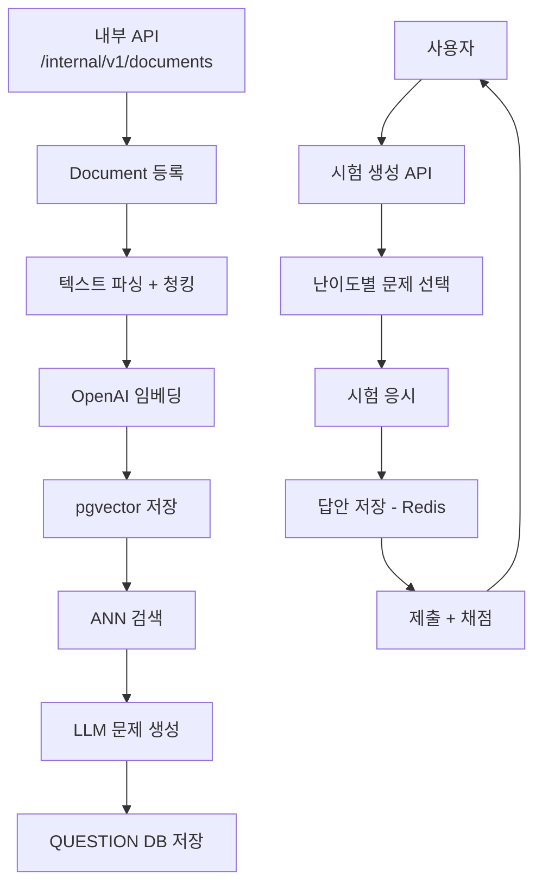

# TMK (Test My Knowledge)

> **AI 기반 자동 문제 생성 및 지능형 시험 플랫폼**
> 버전: 0.0.1-SNAPSHOT | 상태: MVP 개발 중

## 프로젝트 설명

PDF 문서를 등록하면 OpenAI를 통해 자동으로 시험 문제를 생성하고, 사용자가 시험을 응시하여 학습 이해도를 확인할 수 있는 AI 기반 문제은행 플랫폼입니다.

현재 `tmk-api`에는 정적 웹 UI가 포함되어 있으며, `http://localhost:8080/index.html` 접속 시 비로그인 상태에서는 로그인 진입 화면이, 로그인 후에는 제품 홈 화면이 표시됩니다. 시험 화면은 단순 API 테스트 폼이 아니라 실제 응시 흐름에 가깝게 문제/보기/답안 저장/제출 UI를 제공합니다.

### 핵심 기술 특징

- **RAG 기반 문제 생성**: 문서를 청킹 → OpenAI 임베딩(1536차원) → pgvector ANN 검색 → LLM 문제 생성
- **자동 채점**: Spring Batch가 매분 만료된 시험을 감지하여 자동 제출 및 채점
- **멀티 인증**: 이메일 기반 회원가입 + Google / Kakao / Naver 소셜 로그인
- **캐시 최적화**: Redis로 이메일 인증 코드, JWT 토큰, 시험 임시 답안 관리

---

## 왜 이 서비스가 필요한가?

1. **시험 출제에 드는 시간 낭비**: 교육 자료에서 문제를 수동으로 만드는 작업은 과목당 2~3시간 소요
2. **즉각적 피드백 부재**: 오프라인 평가에서 벗어난 온라인 환경에서 즉시 채점 및 결과 분석이 필요
3. **정형화된 문제 은행의 한계**: 기존 시스템은 고정된 문제만 제공, 새 학습 자료에 맞춘 자동 생성 불가

**TMK 해결책**: PDF 업로드 → 자동 문제 생성 (시간 절감 85% 이상), 즉시 채점, 난이도별 맞춤 시험

---

## 대상 사용자

| 사용자 | 요구사항 | 기대효과 |
|--------|----------|----------|
| **교육 기관** (학교, 학원) | 교과서 기반 시험 자동 출제 | 출제 시간 단축, 문제 은행 자동화 |
| **온라인 교육 플랫폼** | 강의 콘텐츠 맞춤 퀴즈 생성 | 학습자 참여도 증가 |
| **개인 학습자** | 학습 자료 기반 자가 진단 | 이해도 정량화, 학습 동기 부여 |

---

## 기술 스택

| 분류 | 기술 | 버전 |
|------|------|------|
| 언어 | Java | 21 LTS |
| 프레임워크 | Spring Boot | 3.5.11 |
| 보안 | Spring Security + JJWT | 6.x / 0.12.6 |
| DB | PostgreSQL + pgvector | 14+ / 0.5.0+ |
| 캐시 | Redis | 7.x |
| ORM | Spring Data JPA | Spring Boot 3.5 |
| 배치 | Spring Batch | Spring Boot 3.5 |
| AI | OpenAI API | text-embedding-3-small, GPT-4 |

> 자세한 기술 선택 이유 및 개발 환경 설정은 [기술 스택.md](./기술 스택.md) 참고

---

## 아키텍처

### 멀티 모듈 구조

```
tmk-parent/
├── tmk-core/     # 도메인 엔티티, 애플리케이션 서비스, outbound port
├── tmk-infra/    # Spring Data JPA repository + persistence adapter
├── tmk-api/      # REST API, Spring Security, JWT, AI/Redis adapter, static web UI
└── tmk-batch/    # Spring Batch (만료 시험 자동 제출, 인증코드 정리)
```

**의존성 방향**: `tmk-api` → `tmk-core`, `tmk-infra` / `tmk-batch` → `tmk-core`, `tmk-infra`

**구조 원칙**: 코어 서비스는 JPA repository를 직접 참조하지 않고 `Port`에만 의존합니다. DB 접근은 `tmk-infra`의 adapter가 담당합니다.

**포트 분류**: `tmk-core`의 outbound port는 역할별로 `port.out.persistence`, `port.out.ai`, `port.out.cache`, `port.out.security`로 분리합니다.

> 패키지 구조 및 도메인 설계는 [도메인 모델 설계.md](./도메인 모델 설계.md) 참고

### 문제 생성 파이프라인

```
PDF 수신
  ↓
텍스트 파싱 + 청킹
  ↓
OpenAI 임베딩 (text-embedding-3-small, 1536차원)
  ↓
pgvector 저장 (HNSW 인덱스, m=16, ef_construction=64)
  ↓
ANN 검색 (코사인 유사도) → LLM 문제 생성
  ↓
QUESTION 테이블 저장
```

### 웹 UI 구성

- `index.html`: 로그인 화면 + 로그인 후 홈 대시보드
- `exams.html`: 시험 시작, 문항 이동, 보기 선택, 임시 저장, 제출, 결과 조회
- `documents.html`: 경로 기반 등록, 파일 업로드 등록, 처리 상태 조회
- `questions.html`: 문제 목록 필터링 및 상세 확인
- `auth.html`: 이메일 인증, 회원가입, 로그인, 토큰 재발급

### 시스템 아키텍처 다이어그램



---

## 요구사항 (MVP)

### 1. 사용자 인증

- 이메일 + 비밀번호 회원가입 (이메일 인증 코드 5분 유효)
- 이메일 / 비밀번호 로그인 → JWT 발급
- 로그아웃 (토큰 무효화)
- 소셜 로그인 (Google, Kakao, Naver)
- JWT 토큰 재발급

### 2. 문제 생성

- 내부 API를 통해 PDF 문서 등록 (MVP에서 사용자 직접 등록 불가)
- 등록 방식: 파일 업로드(`POST /internal/v1/documents/upload`) 또는 서버 파일 경로 전달(`POST /internal/v1/documents`)
- AI 자동 문제 생성 (문서당 최소 2개)
- 문제 유형: 객관식(5지선다), 단답형, 참/거짓
- 난이도: 쉬움 / 보통 / 어려움
- 각 문제에 정답 + 해설 포함

### 3. 시험 기능

- 시험 생성: 최소 10문제, 각 난이도별 최소 1문제
- 시험 시간: 기본 30분
- 답안 저장 및 수정 (시험 시간 내)
- 조기 제출 가능
- 시험 시간 초과 시 Spring Batch가 자동 제출
- 채점: 정답률 50% 이상 → 합격

### 4. 시험 히스토리

- 응시 이력 목록 조회 (총점, 합격 여부)
- 상세 조회 (문제별 내 답안, 정답, 해설)

### 5. 비기능 요구사항

- 인증된 사용자만 서비스 이용 가능
- 사용자 데이터 및 시험 결과 안전 저장
- AI 문제 생성 파이프라인 안정적 운영
- 확장 가능한 모듈화 구조

---

## 주요 사용 시나리오

### 교사의 시험 준비

```
교사: 교과서 PDF 업로드 → TMK 자동 문제 생성 (10분)
     → 생성된 문제로 시험 구성 → 학생 응시 → 자동 채점
     (기존 수동 출제 2~3시간 → 85% 시간 절감)
```

### 학생의 자가 진단

```
학생: 학습 자료 업로드 → 자동 문제 생성
    → 시험 응시 → 즉시 채점 및 해설 확인 → 취약 부분 재학습
```

---

## 구현 현황 (현재 코드 기준)

| 영역 | 상태 | 비고 |
|------|------|------|
| 도메인 엔티티 (User, Document, Question, Exam) | ✅ 완료 | |
| JWT 생성 / 검증 | ✅ 완료 | |
| Spring Security 설정 | ✅ 완료 | |
| 시험 생성/채점/이력 서비스 | ✅ 완료 | 생성, 저장, 제출, 결과/이력 조회 포함 |
| 인증 서비스 | ✅ 완료 | 이메일 인증, 회원가입, 로그인, 로그아웃, 재발급 |
| API 컨트롤러 | ✅ 완료 | 현재 문서의 경로 기준 |
| 내부 문서 등록 API | ✅ 완료 | 파일 업로드 + 경로 기반 등록 지원 |
| Spring Batch 잡 | ✅ 완료 | 만료 시험 자동 제출, 인증코드 정리 |
| 정적 웹 UI | ✅ 완료 | 제품형 로그인 홈 + 시험 응시 화면 포함 |
| OpenAI 통합 | ✅ 완료 | 운영 환경에서는 OpenAI API billing/quota 설정 필요 |
| 테스트 코드 | ✅ 작성됨 | 모듈별 단위/통합 테스트 존재 |

---

## 관련 문서

| 문서 | 내용 |
|------|------|
| [API 명세서.md](./API 명세서.md) | 전체 REST API 엔드포인트 상세 명세 |
| [ERD 설계.md](./ERD 설계.md) | 데이터베이스 테이블 구조 및 인덱스 설계 |
| [도메인 모델 설계.md](./도메인 모델 설계.md) | 클린 아키텍처 기반 도메인 모델 및 UseCase 목록 |
| [기술 스택.md](./기술 스택.md) | 기술 선택 이유, 개발 환경 설정, 환경 변수 |
| [ddl.sql](./ddl.sql) | 실제 DDL SQL |
